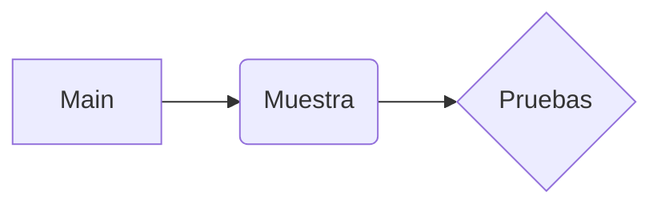

# Bienvenido a nuestros ejercicios
Somos Gabo y Micha.

## Ejercicios
Todos los ejercicios hechos, metidos en el main, muchas pruebas.

- Main (El **Main** tiene muchas cosas),
- El resto (El resto de archivos también tienen cosas).

> **Nota:** Todos los ejercicios los hemos hecho con amor

> **ProTip:** Ejecutas el main y hace todos los ejercicios **con ejemplos**.

